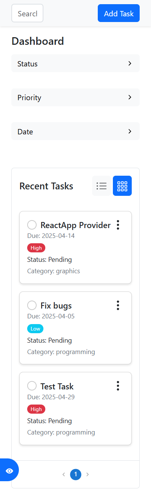

# 📋 Task Management App

<div style="background-color: #1a1a1a; color: #e0e0e0; padding: 20px; border-radius: 10px;">

Welcome to the **Task Management App**, a comprehensive and user-friendly application built to streamline task organization and management. Developed with a modern React-based frontend, this project combines powerful features with an intuitive interface, making it ideal for both personal and team productivity.

</div>

---

## ✨ Features

<div style="background-color: #2d2d2d; color: #e0e0e0; padding: 15px; border-radius: 8px;">

- **Task Overview:** Display tasks in customizable table or grid views.
- **Filtering & Searching:** Filter tasks by priority, status, and date, with a robust search functionality.
- **Task Management:** Add, edit, delete, and mark tasks as completed with real-time updates.
- **Responsive Design:** Seamlessly adapts to desktop and mobile devices.
- **Undo Support:** Revert changes with an easy undo option.
- **Pagination:** Navigate large task lists with a smooth pagination system.
- **List Management:** Organize tasks into lists with status tracking.

</div>

---

## 🚀 Getting Started

<div style="background-color: #1a1a1a; color: #e0e0e0; padding: 20px; border-radius: 10px;">

### Prerequisites

- Node.js (v18.x or later)
- npm or yarn
- Git

### Installation

1. Clone the repository:
   ```bash
   git clone https://github.com/your-username/task-management-app.git
   ```

2. Navigate to the project directory:
   ```bash
   cd task-management-app
   ```

3. Install dependencies:
   ```bash
   npm install
   # or
   yarn install
   ```

4. Start the development server:
   ```bash
   npm start
   # or
   yarn start
   ```

5. Open your browser and visit:
   ```
   http://localhost:3000
   ```

### Backend Setup (Optional)

- Ensure a local Node.js/Express API is running at `http://localhost:3000` for task and list data.
- Configure API endpoints in `src/context/TaskContext.jsx` if using a custom backend.

</div>

---

## 📸 Screenshot

<div style="background-color: #2d2d2d; padding: 15px; border-radius: 8px;">
  
</div>
<div style="background-color: #2d2d2d; padding: 15px; border-radius: 8px;">
  
</div>
---

## 🛠️ Technologies Used

<div style="background-color: #1a1a1a; color: #e0e0e0; padding: 20px; border-radius: 10px;">

- **Frontend:** React, React Router, React-Bootstrap-Icons
- **State Management:** React Context API
- **HTTP Requests:** Axios
- **Styling:** CSS Modules
- **Notifications:** React Hot Toast
- **Backend:** Node.js/Express (local API at `http://localhost:3000`)

</div>

---

## 📂 Project Structure

<div style="background-color: #2d2d2d; color: #e0e0e0; padding: 15px; border-radius: 8px;">

```
task-management-app/
├── src/
│   ├── components/          # Reusable React components (e.g., Table, Filter, Sidebar)
│   ├── context/            # Context providers for state management
│   ├── utils/              # Utility functions and helpers
│   ├── pages/              # Page-level components (e.g., CreateList, ManageLists)
│   ├── App.jsx             # Main application component
│   ├── main.jsx            # Application entry point
│   └── index.css           # Global stylesheet
├── public/                 # Static assets (e.g., images, favicon)
├── package.json            # Project dependencies and scripts
└── README.md               # Project documentation
```

</div>

---

## 🤝 Contributing

<div style="background-color: #1a1a1a; color: #e0e0e0; padding: 20px; border-radius: 10px;">

We welcome contributions from the community! Here's how to get involved:

1. Fork the repository.
2. Create a new branch (`git checkout -b feature-branch`).
3. Make your changes and commit them (`git commit -m "Add new feature"`).
4. Push to the branch (`git push origin feature-branch`).
5. Open a Pull Request with a clear description of your changes.

</div>

---

## ⚠️ Issues

<div style="background-color: #2d2d2d; color: #e0e0e0; padding: 15px; border-radius: 8px;">

Encountered a bug or have a suggestion? Please open an issue on [GitHub Issues](https://github.com//zeyadwaled25/task-management-app/issues) with details to help us address it quickly.

</div>

---

## 📜 License

<div style="background-color: #1a1a1a; color: #e0e0e0; padding: 20px; border-radius: 10px;">

This project is licensed under the MIT License. See the [LICENSE](LICENSE) file for more details.

</div>

---

## 🌟 Acknowledgments

<div style="background-color: #2d2d2d; color: #e0e0e0; padding: 15px; border-radius: 8px;">

- Grateful to the open-source community for libraries like React, Axios, and Material-UI.
- Inspired by modern productivity tools and collaborative development practices.
- Last updated: 12:38 AM EEST, Saturday, May 17, 2025.

</div>
